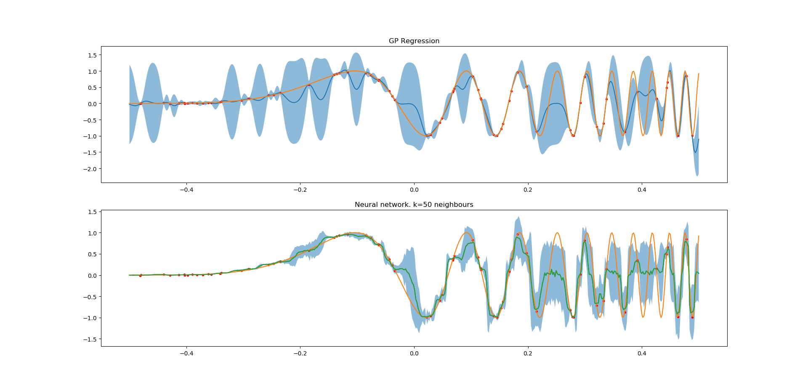

# ccnet
Project for using deep learning for nonlinear regression with few variables. Spatial interpolation etc.
## Requirements

-NumPy

-keras

-tensorflow

Examples use scikit-learn and matplotlib

## API

Initialize:

  cc=CCNet(num_neighbors=10,do_rate=0.1,id_dropout=0.02,shuffle=False,model=None)

Fit model:

    cc.fit(X,Y,epochs=n_epochs,batch_size=batch_size,verbose=True)
    
Predict:

    Yp=cc.predict(Xp)
Or:

    Yp,ypstd=cc.stochastic_predict(Xp,n_iter=100)

do_rate - Dropout
id_dropout - Dropout on datapoint with distance 0 during fit.
shuffle - Shuffle order of the neighbors during stochastic predict and fit.
model - Supply own keras model. (See get_model() in model.py)

## Example

